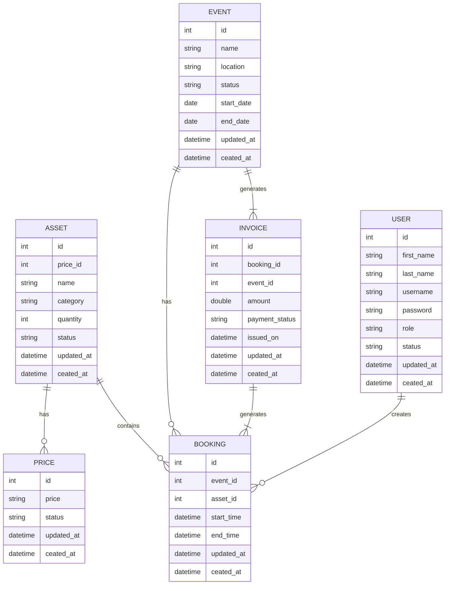
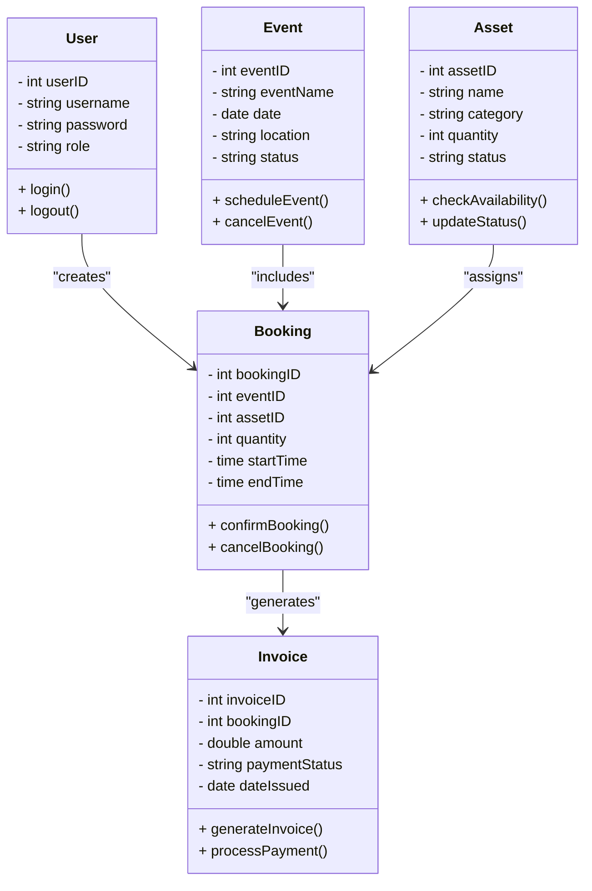

# Event Scheduling System (ESS)

## DESCRIPTION

Java Entertainment is a stage equipment business that offers the rental of equipment for events requiring staging,
lighting, power and sound. The managers of the company are currently facing an issue scheduling the equipment for all
the events for the upcoming Jamaican Spring Break season. You are hired to write a software that will assist the company
in the management and scheduling of their assets.

**Asset Management Module:**

The company should be able to keep track of all assets they have acquired and stored in their inventory.

**Scheduling Module:**

The company should be able to schedule their equipment for upcoming events. Bear in mind that a piece of equipment
cannot be scheduled for two events simultaneously.

**Billing Module**

The company should be able to create invoices for quotations and generate receipts for bookings and rentals.

**Reporting Module ( OPTIONAL)**

The manager should be able to pull up the report for all bookings for a particular day or between user-specified
periods. It should also be able to generate a report of the revenue from current and future bookings.

Entity Design
Design your database diagram and class diagram that you will use to model your database which is due week 2 for
approval. NB. Resolve all foreign keys and relationships. Pay close attention to many to many relationships and 3rd
normal form normalization before building your classes.

**Software Architecture**

Design a JAVA application that will meet the requirements. Your application should be built using the Client/Server
architecture. Your Database should be located on the server machine where the client will make requests to the server
over the network. The server will grant the corresponding request from the client. Your application should be developed
with a graphical user interface that will aid the users in the system for their respective data entry and processing.
Please include a GUI to interact with the data for all database tables.

**Extra Credit 1 (5%)**

In order to accommodate multiple users at the same time, the server thus needs to be threaded to accommodate multiple
clients that will connect to it to interact with the database. Users need their own accounts (username and password).

**Extra Credit 2 (5%)**

Your application should be able to print the reports in a presentable format. For this you may export the report to a
PDF document. The marks for this section may be awarded at the discretion and satisfaction of you lab tutor. This does
not entail a screenshot of your Java GUI application form.
Assessment

This project is a team effort and should be done in groups consisting of no less than 4 persons, maximum 5 persons.
Please stick to programming conventions such as proper indentation.

Include comments (one to briefly describe the function and any other special/important lines). This is important for
generating docs

Classes begin with capital letters (ex: **PascalCase**), functions begin with common letters followed by initial caps (
ex: **camelCase()**)

Variables should have meaningful names. Refrain from using ‘x’ or any other single letter variables. Variables also
begin with common letters followed by initial caps (**camelCase**). Underscores are also permitted in all lower case. (
ex: **registration_status**)

This project is valued at 25% of your final grade. 10% of this grade will be assessed in a continuous manner each week.
Failure to meet the required milestones each week will result in a loss of the continuous grade.

**NO INDIVIDUAL PROJECTS WILL BE ACCEPTED**

## Get Started

- Java 21
- IntelliJ IDEA Ultimate (Community Edition) Recommended or Eclipse
- MySQL
- Scene Builder

> NOTE: If you are using Eclipse
>
> Setup plugin for Eclipse [Link](https://projectlombok.org/setup/eclipse) to add support for lombok

## What's in this project?

| Component      | Description                                                                                                                                                                                                                    |
|----------------|--------------------------------------------------------------------------------------------------------------------------------------------------------------------------------------------------------------------------------|
| Server         | A server is a computer or system that provides resources, services, or data to other computers, known as clients, over a  network.                                                                                             |
| Client         | A client is a device or software application that requests and consumes services, resources, or data from a server over a network.                                                                                             |
| Documentations | Documentation refers to organized records, manuals, or guides that provide detailed information about a system, software, or process to aid users, developers, and administrators in understanding, using, and maintaining it. |

## Project expectations

| Deliverables                 | Description                                                                                                                                                | Status |
|------------------------------|------------------------------------------------------------------------------------------------------------------------------------------------------------|--------|
| Entity Design                | Object Model (including abstract classes, interfaces, inheritance and polymorphism), Database Relations                                                    | ✴️     |
| User Experience              | Use of standard GUI components, Parent windows, Menus, Message Dialogs and consistent UX                                                                   | ✴️     |
| Client / Server Architecture | Implementation of Client Server architecture using TCP/IP sockets for networking                                                                           | ✴️     |
| Exception Handling, Logging  | Handle all exceptions and provide logs for an audit trail                                                                                                  | ✴️     |
| Database Connectivity        | Database Connectivity (using both relational and ORM methods, at least 1 table must use ORM)                                                               | ✴️     |
| Generics and Collection      | Should be integrated within some functionality like Networking and DB connectivity                                                                         | ✴️     |
| Documentation                | Both formal and self documenting code comments (User Manual)                                                                                               | ✴️     |
| Core Functions as described  | Core functions are the essential capabilities of a system or organization that enable it to achieve its primary objectives efficiently.                    | ✴️     |
| Threading                    | Threading is the process of executing multiple tasks concurrently within a single process to improve performance and responsiveness.                       | ✴️️    |
| Reporting Module             | A Reporting Module is a system component that collects, processes, and presents data insights through structured reports for analysis and decision-making. | ✴️️    |

## ERD Diagram

## CLASS Diagram

## Group Member Assignments Breakdown

| Name           | ID Number | Deliverables                                       | Status |
|----------------|-----------|----------------------------------------------------|--------|
| Wycliffe Peart | 1105936   | Client / Server Architecture   User Experience | ✅️     |
